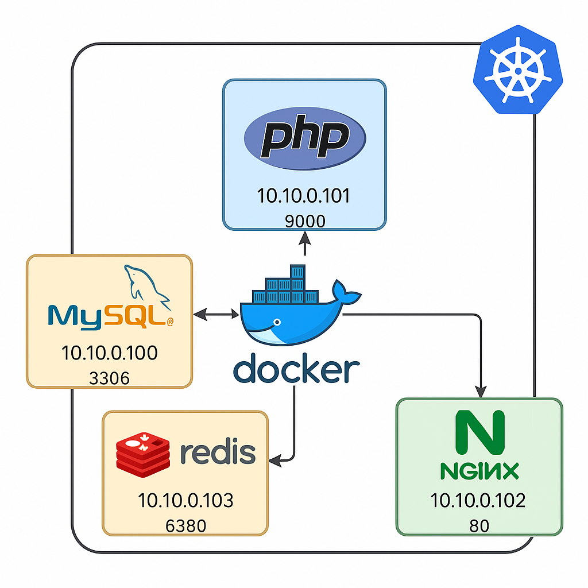

<div align="center">

# dockerize-php-xapp

[](https://github.com/soulaimaneyahya/dockerize-php-xapp/actions/workflows/ci-cd.yaml)

</div>



- [x] simple project dockerize php-nginx-mysql
- [x] simple php-code
- [x] redis-database
- [x] deploy k8s

project folder structure

```sh
├── docker-compose.yaml
├── services/
│   ├── database/
│   │   ├── mysql/
│   │   │   ├── Dockerfile
│   │   │   ├── .env
│   │   ├── redis/
│   │   │   ├── Dockerfile
│   │   │   ├── .env
│   └── web/
│       ├── nginx/
│       │   ├── Dockerfile
│       │   ├── nginx.conf
│       │   ├── fastcgi_params
│       │   └── .env
│       └── php/
│           ├── public/
│           │   └── index.php
│           ├── src/
│           ├── composer.json
│           ├── Dockerfile
│           ├── .env
├── infra/
│   ├── k8s/
│       ├── deployments/
│       └── services/
```

**resources**;
- [Managing Linode cloud K8s infra using Terraform - GitHub repo](https://github.com/soulaimaneyahyax/terraform-linode-k8s)
